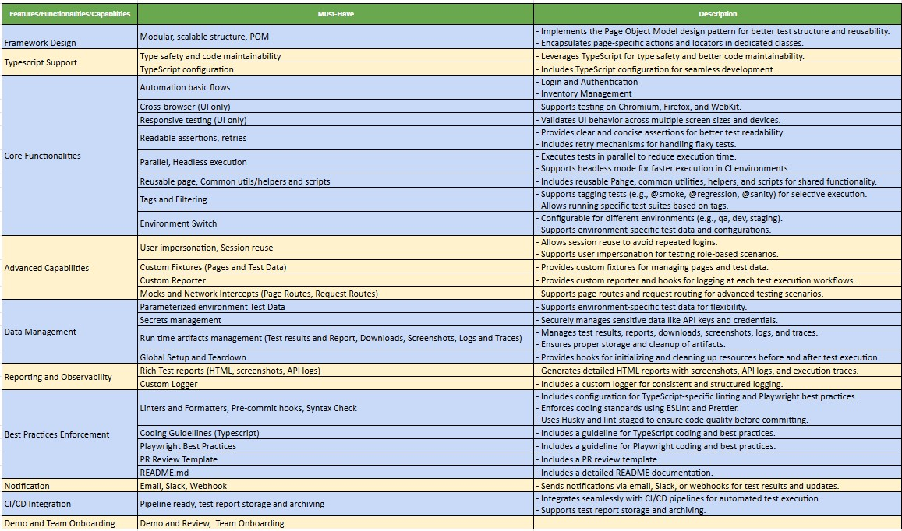

# playwright-ui-test-framework

## Table of Contents

- [Overview](#overview)
- [Key Features/Functionalities/Capabilities](#key-featuresfunctionalitiescapabilities)
- [Tech Stack](#tech-stack)
- [Prerequisite Software and Tools](#prerequisite-software-and-tools)
- [Installation](#installation)
- [Running Tests](#running-tests)
- [Generate and open Test Report](#generate-and-open-test-report)
- [Sending Notifications](#sending-notifications)
- [Validating Syntax and Linting Rules](#validating-syntax-and-linting-rules)

## Overview

This project is a Functional UI Test Automation Framework built using Playwright and TypeScript. It is designed to provide a robust, scalable, and maintainable solution for automating end-to-end UI testing for web applications. The framework includes features for test execution, reporting, and code quality enforcement, ensuring high-quality test automation.

## Key Features/Functionalities/Capabilities



This framework is designed to accelerate the development and execution of UI tests, ensuring high test coverage and reliability for web applications.

## Tech Stack

- Typescript
- Playwright
- Allure Report

## Prerequisite Software and Tools

- Node 20.X

## Installation

### Clone the repository

```sh
git clone https://github.com/AshisRaj/playwright-ui-test-framework.git
```

### Packages installations

- yarn install

## Running Tests

```sh
# Run all tests in headless mode
yarn test
or
yarn run test
# Run all tests in headed mode
yarn test:headed
or
yarn run test:headed
```

## Generate and open Test Report

```sh
yarn posttest
or
yarn posttest
```

## Sending Notifications

```sh
yarn notify-report
or
yarn run notify-report
```

## Validating Syntax and Linting Rules

It is recommended to run Linting and syntax validation scripts locally before pushing changes to your branch in order to prevent broken code, or code that does not meet basic coding standards, making it into your remote branch.

📝 Syntax, and linting errors, must be fixed before a feature branch is allowed to be merged with the main branch, i.e. `main`.

### Syntax Validation

```sh
yarn syntax-check
or
yarn run syntax-check
```

### Run Linting Rules

```sh
yarn lint
or
yarn run lint
```
